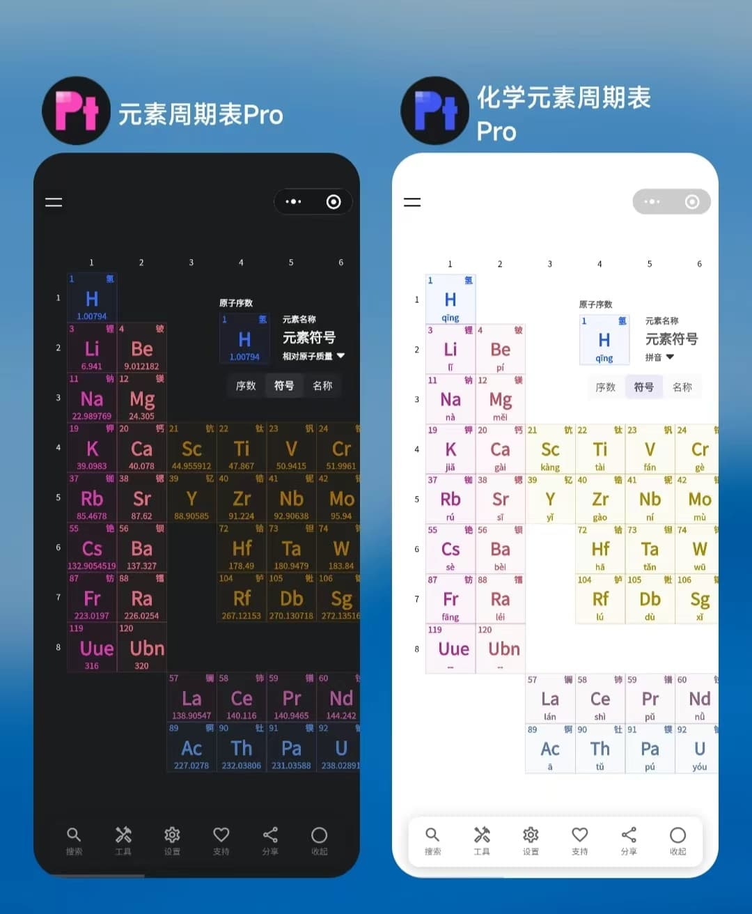
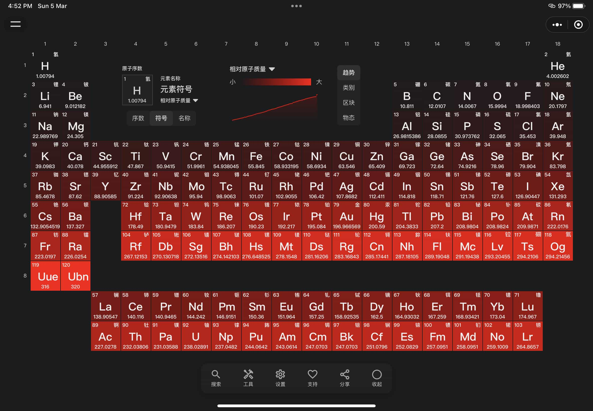
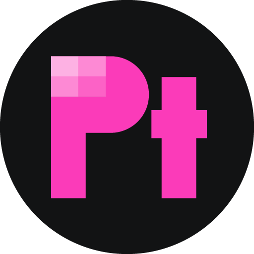
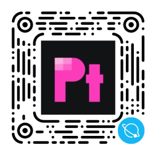
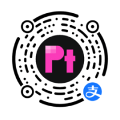

<h1 align="center">
    
     
     
    元素周期表PRO
</h1>

高颜值的化学元素周期表工具，提供全面的元素属性、图片和百科知识等

 
 

## 简介

元素周期表 Pro 是由欢洋精心打造的**原创化学元素周期表工具**，采用全新的设计风格，支持[Web（H5）](https://periodic-table-pro.netlify.app)、微信小程序、QQ 小程序和支付宝小程序等多种平台，适配不同尺寸的屏幕设备。

<table>
    <tr>
        <td width="37.5%">
            
        </td>
        <td width="62.5%">
            
        </td>
    </tr>
</table>

 

 

## 网站

Nextjs 构建的网站，项目目录 `periodic-table-pro/website`

<a href="https://periodic-table-pro.netlify.app">
    <!--  -->
    元素周期表PRO - 高颜值化学必备小工具
</a>

 

## 小程序

Tarojs 构建的多端兼容小程序，项目目录 `periodic-table-pro/weapp`

<table>
<tr>
    <td width="33%">
        
        
微信小程序

    </td>
    <td  width="33%">
        
        
QQ小程序

    </td>
    <td  width="33%">
        
        
支付宝小程序

    </td>
</tr>
</table>

 
 

## 环境变量

- `PLATFORM` —— 代替 `process.env.TARO_ENV`， 在 Nextjs 项目中值为 `next`
- `BUCKET_HOST` —— 云服务静态资源存储桶地址，例如 `https://xxx.cos.ap-shanghai.myqcloud.com`

 

## 小程序与 Web 端的兼容方案简介

该项目网站采用 Nextjs, 小程序端采用 Tarojs + React, 并在网站和小程序之间复用了大量的组件。

在 Taro 项目中使用 `@tarojs/plugin-html` 插件将 html 标签转译为对应小程序的模版。

在 `periodic-table-pro/packages/components/compact` 目录中实现了一些根据环境变量同时兼容 Nextjs 与 Tarojs 环境的组件和 API。例如`Image`、`Navigator`、`previewImage`、`navigatorTo` 等。

最后在需要复用的组件中使用这些兼容版的组件和 API。
