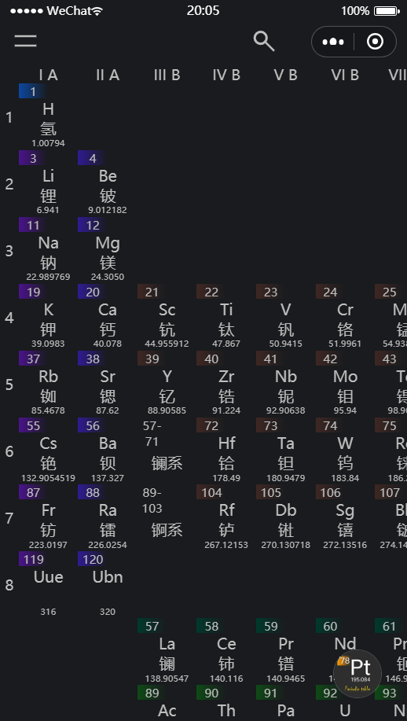
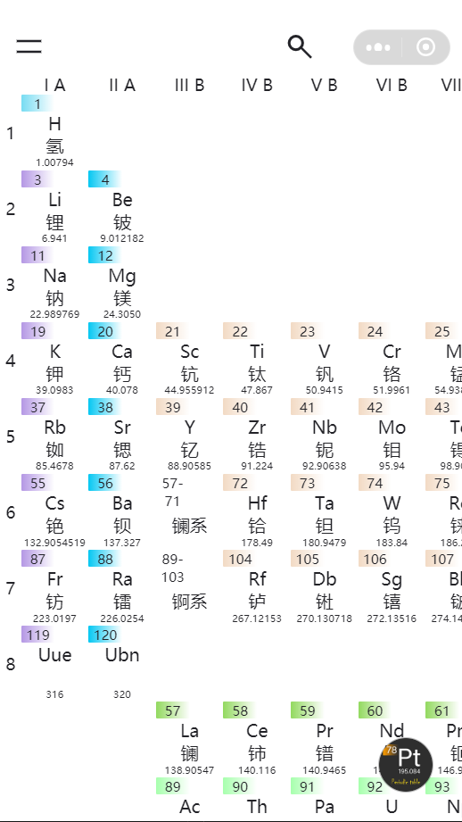
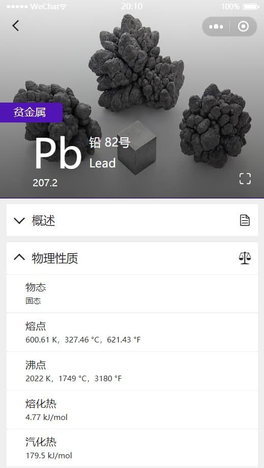
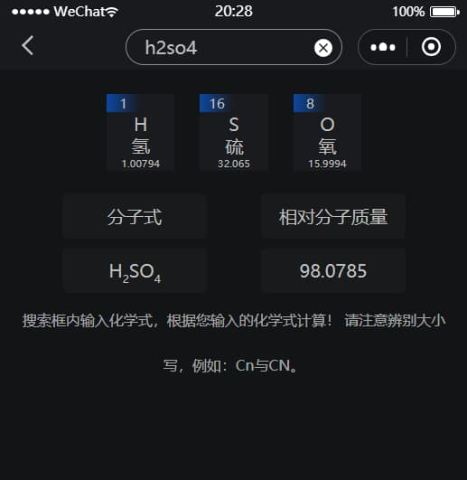
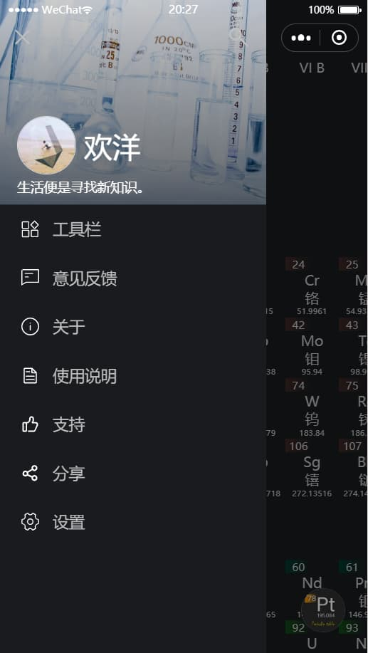
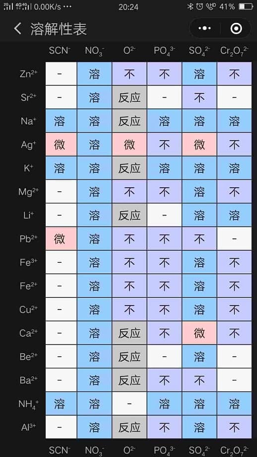
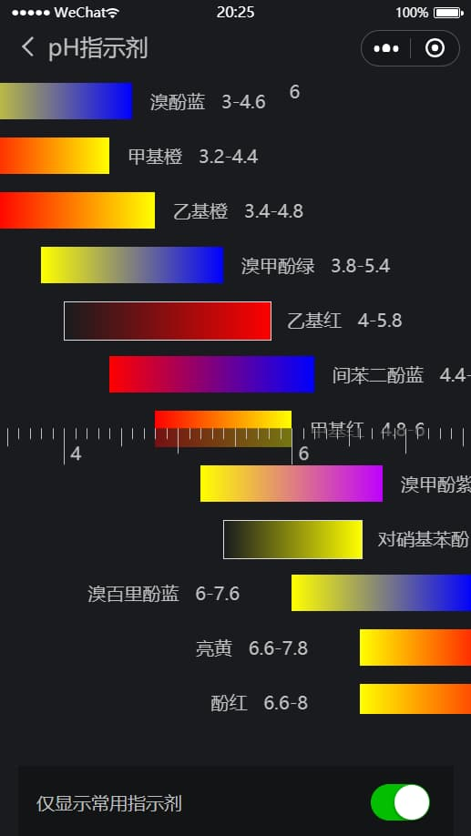
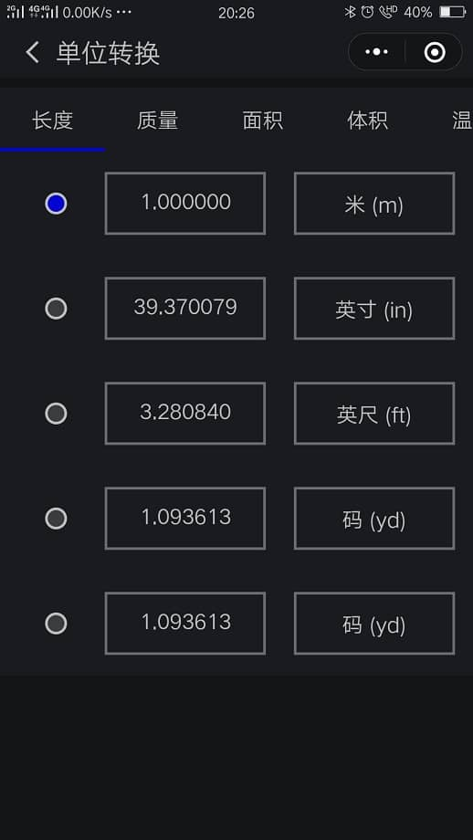
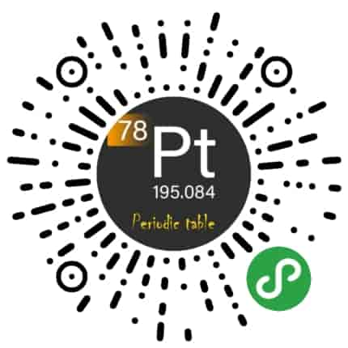

# PeriodicTable-Pro
微信小程序-元素周期表Pro是一个工具类的微信小程序
小程序主要有以下功能
- 化学元素周期表表格
- 各元素的详细信息
- 元素的搜索
- 化学式相对分子量计算
- 溶解性表格
- 酸碱指示剂变色范围
- 希腊字母表
- 单位换算
- 深色和浅色主题

# 图

# 体验
- 微信扫一扫
 

- 微信内搜索「元素周期表Pro」不用加“化学”两个字哦~

# 评分
4.6 / 5

# Copyright
保留一切权利