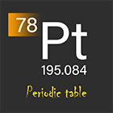

<h1 align="center">
    
     
     
    元素周期表Pro
</h1>

化学元素周期表小程序

## 表格功能

    <video
        src="src/assets/videos/emphasize_guide.mp4"
        autoplay
        loop
        style="grid-area: a;width: 100%;"
    ></video>
    <video 
        src="src/assets/videos/color_guide.mp4"
        autoplay
        loop
        style="grid-area: c;width: 100%;"
    ></video>
    <video
        src="src/assets/videos/properties_guide.mp4"
        autoplay
        loop
        style="grid-area: b;width: 143%;"
    ></video>

https://user-images.githubusercontent.com/33485493/167868717-22364f57-b9fc-459a-b2ba-470cc9d289e3.mp4

https://user-images.githubusercontent.com/33485493/167868720-ac7da089-f3fb-404b-965d-cc35442d9aa1.mp4

https://user-images.githubusercontent.com/33485493/167868738-7feef00d-1136-427f-974a-de73422eeb1d.mp4

## 小程序码

## 网页APP

[元素周期表Pro](https://periodic-table-pro.netlify.app)

