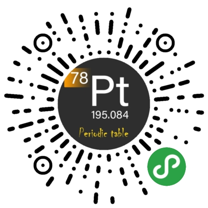
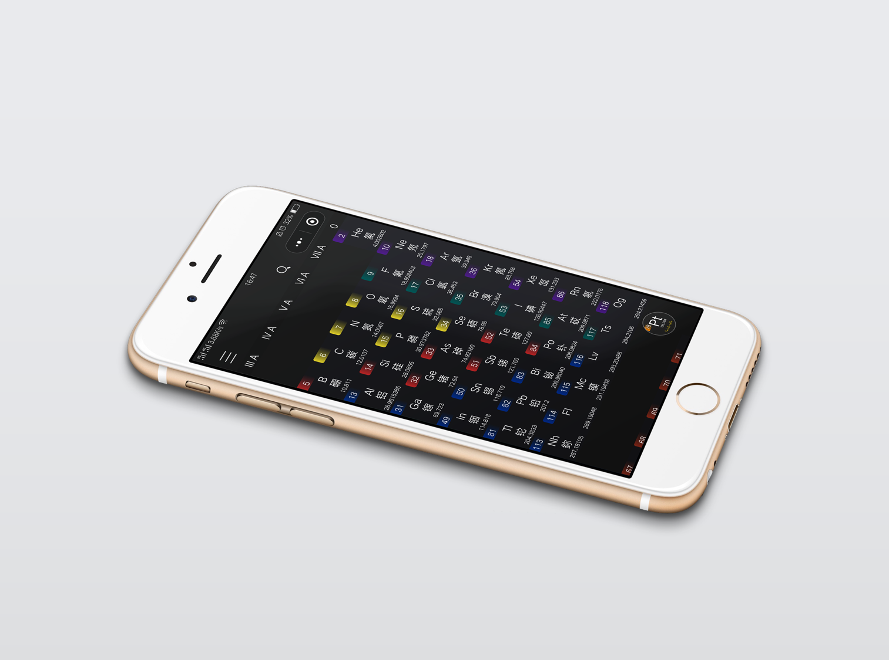
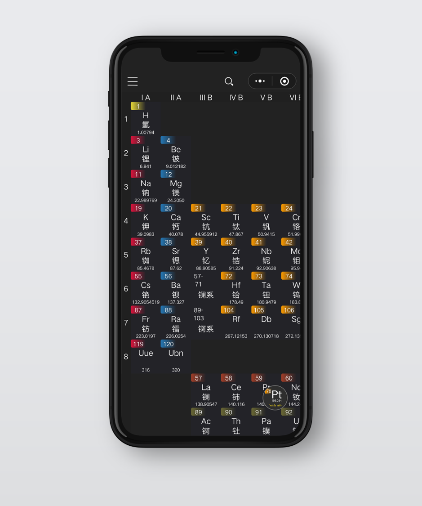

# PeriodicTable-Pro
微信小程序，元素周期表Pro (化学元素周期表)
	
化学元素周期表是化学、化工、材料等学科的学习工具。获取更多元素信息，快速计算相对分子质量，查询溶解性，图示酸碱指示剂变色范围。

# 扫码体验-元素周期表Pro

# 样机图

# 项目说明
此项目源文件仅可用作学习用途。

如要在微信开发工具中运行，请把`./data/.data_part.js`重命名为`./data/data.js`，data_part.js中仅保留了部分元素的详细信息。
原项目`./data/image/spectral`中的图片未上传至Github,此目录下为元素的原子光谱图片，图片命名方式为`H.png`,`Ac.png`。

